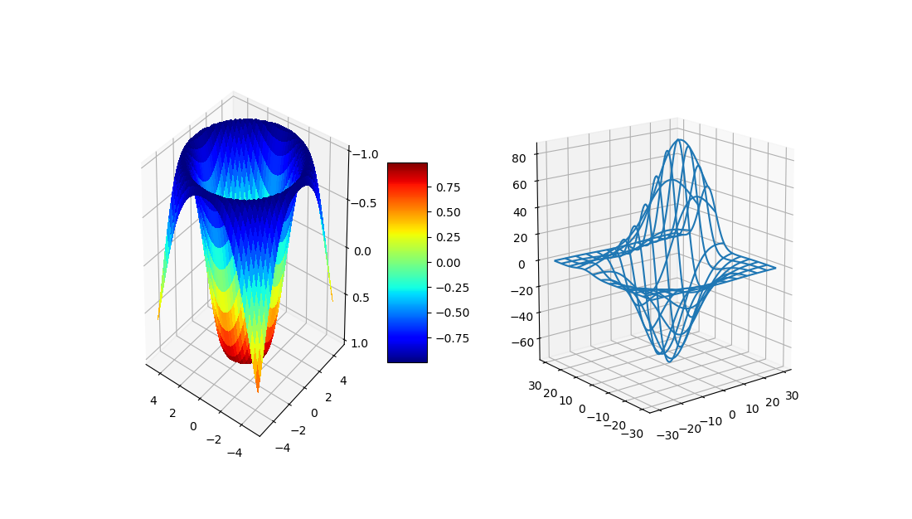
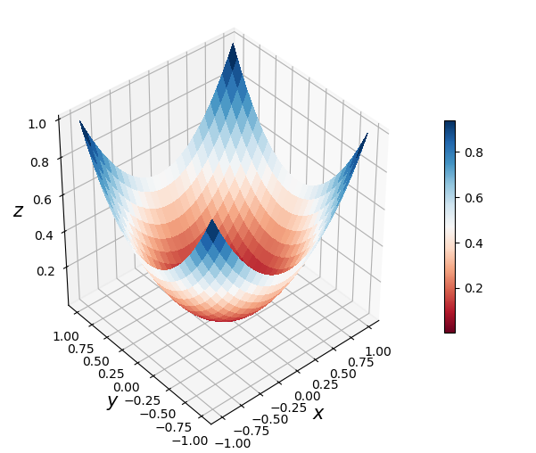
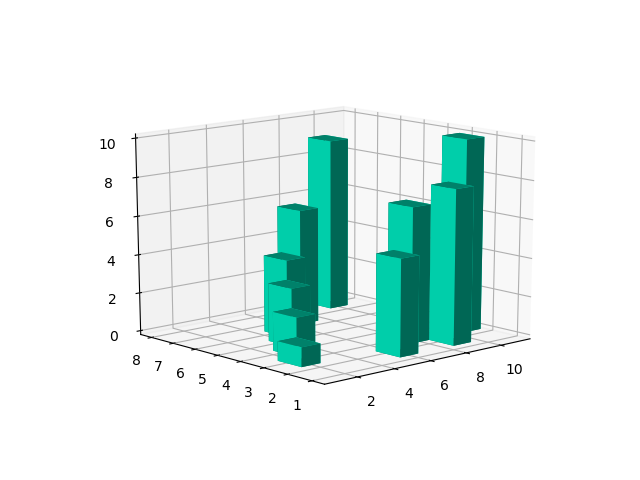

# cse-using-python
## Computational Science and Engineering Using Python - NPTEL MOOC by IIT Kanpur  
Course Instructor - Dr Mahendra Kumar Verma  
Link to the course can be found [here](https://nptel.ac.in/courses/115/104/115104095/)  

---
Some of the amazing plottings done as a part of the course . 

